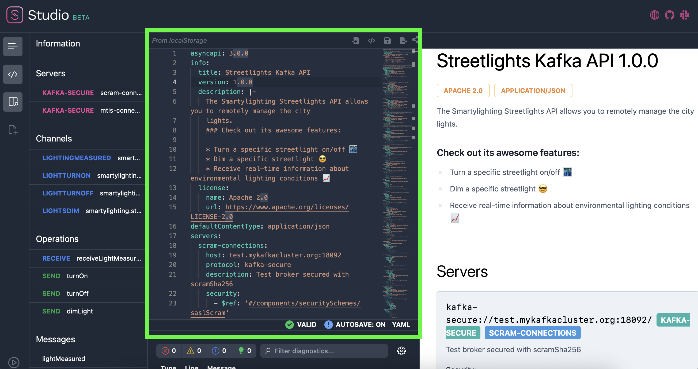
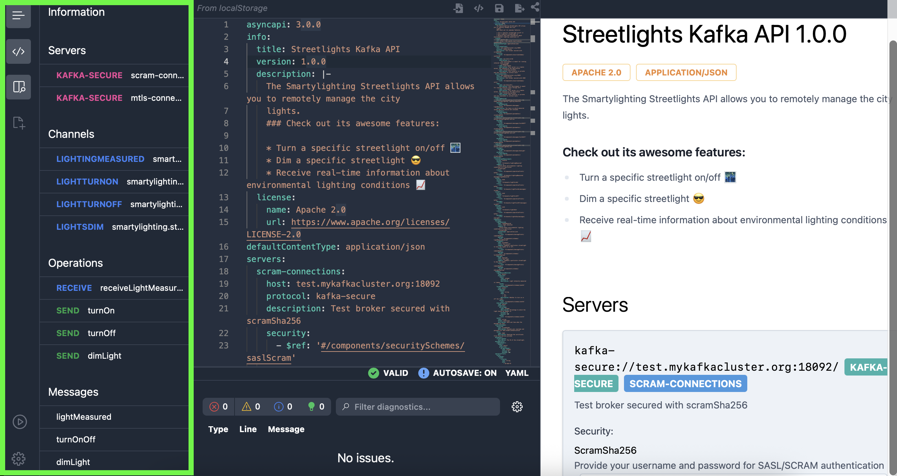
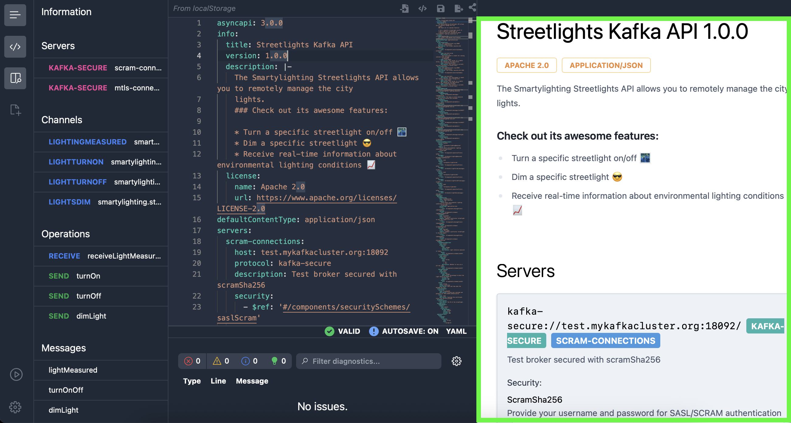

## Getting Started with the Interface

When you first open AsyncAPI Studio, you'll see the main editor interface with the following components:

1. **Editor Panel**: The central area where you write and edit your AsyncAPI document  
   
2. **Navigation Sidebar**: Access different views and tools  
   
3. **Preview Panel**: View documentation, visual diagrams, or generated code  
   
4. **Toolbar**: Access common actions like validation, saving, and sharing 

## Creating a New AsyncAPI Document

To create a new AsyncAPI document:

1. Click on the **New Document** button in the toolbar  
2. Select the AsyncAPI version you want to use (2.0.0, 2.1.0, 2.2.0, etc.)  
3. Choose a template to start with (Minimal, Kafka, MQTT, etc.) or start from scratch  
4. Begin editing your document in the editor panel  

## Editing AsyncAPI Documents

The Studio editor provides several features to help you create and edit AsyncAPI documents:

### Syntax Highlighting

The editor automatically highlights different parts of your AsyncAPI document to make it easier to read and understand:

- Keywords and property names
- Values and types
- References and components
- Comments and annotations

### Code Completion

As you type, the editor suggests completions based on the AsyncAPI specification:

1. Press **Ctrl+Space** (or **Cmd+Space** on Mac) to manually trigger suggestions  
2. The editor will suggest property names, values, and schema components based on the context

### Error Detection

The editor validates your document in real-time and highlights errors:

- Syntax errors are marked with red squiggly underlines
- Hover over an error to see a description of the problem
- The status bar at the bottom shows the total number of errors and warnings
- We also a diagnostic panel that lists all errors and warnings in your document, which also allows you to filter errors. 

## Converting Between AsyncAPI Versions

To convert your AsyncAPI document to a different version:

1. Click on the **Convert** button in the toolbar  
2. Select the target version you want to convert to  
3. Review the converted document in the preview panel  
4. Click **Apply** to replace your document with the converted version, or **Cancel** to discard  

## Converting between YAML and JSON

To convert your AsyncAPI document between YAML and JSON formats:
1. Click on the **Convert** button in the toolbar
2. Select the 'Convert to JSON' or 'Convert to YAML' option
3. The editor will switch to the selected format, preserving the document structure

## Previewing Documentation

To see how your AsyncAPI document will be rendered as documentation:

1. Click on the **Preview** tab in the preview panel  
2. The documentation will be rendered using the AsyncAPI React component  
3. Scroll through the preview to see all sections of your document  
4. The preview updates automatically as you edit your document  

## Visualizing Your API

To visualize the structure and message flows of your API:

1. Click on the **Visualize** tab in the preview panel  
2. The visualization will show:
   - Services and operations
   - Message flows between components
   - Message schemas and formats
3. You can:
   - Zoom in/out using the mouse wheel  
   - Drag components to rearrange the diagram  
   - Click on components to see their details  

## Generating Code

To generate code from your AsyncAPI document:

1. Click on the **Generate** tab in the preview panel  
2. Select a template from the dropdown menu  
3. Configure any template-specific options  
4. Click **Generate** to create the code  
5. Download the generated code as a ZIP file  

## Sharing Your AsyncAPI Document

You can share your AsyncAPI document in several ways:

### URL Sharing

1. Click on the **Share** button in the toolbar  
2. Copy the provided URL  
3. Share the URL with others who can view and edit your document  

### File Export

1. Click on the **Download** button in the toolbar  
2. Select the format you want to export to (YAML or JSON)
3. Save the file to your computer or share it directly  

## Keyboard Shortcuts

AsyncAPI Studio provides several keyboard shortcuts to improve productivity:

| Action | Windows/Linux | macOS |
|--------|--------------|-------|
| Save | Ctrl+S | Cmd+S |
| Find | Ctrl+F | Cmd+F |
| Replace | Ctrl+H | Cmd+H |
| Format Document | Shift+Alt+F | Shift+Option+F |
| Validate | Ctrl+Shift+V | Cmd+Shift+V |
| Toggle Comment | Ctrl+/ | Cmd+/ |
| Indent | Tab | Tab |
| Outdent | Shift+Tab | Shift+Tab |

## Best Practices

Here are some tips for effectively using AsyncAPI Studio:

1. **Start with a template**: Use the provided templates as a starting point to save time
2. **Validate regularly**: Validate your document frequently to catch errors early
3. **Use components**: Define reusable schemas in the components section for better organization
4. **Add descriptions**: Include detailed descriptions for operations, messages, and schemas
5. **Use examples**: Provide examples for messages to help users understand the API better
6. **Organize your document**: Use meaningful operation IDs and message names for clarity

## Troubleshooting

If you encounter issues while using AsyncAPI Studio:

1. **Editor not loading**: Try clearing your browser cache and reloading the page  
2. **Validation errors**: Check the AsyncAPI specification version you're using and ensure your document follows that version  
3. **Preview not updating**: Save your document and refresh the preview panel  
4. **Performance issues**: For large documents, consider splitting them into smaller files and using references  